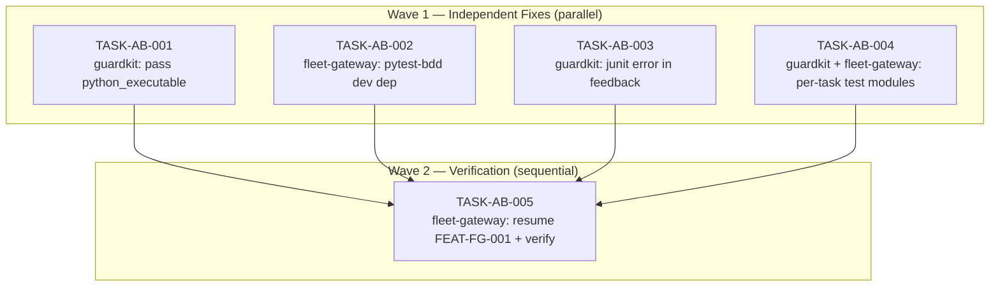

# IMPLEMENTATION-GUIDE: FEAT-AB-FIX (fleet-gateway slice)

**Parent review:** [TASK-REV-8413](../TASK-REV-8413-analyse-autobuild-feat-fg-001-stall.md)
**Findings document:** [docs/history/autobuild-FEAT-FG-001-review.md](../../../docs/history/autobuild-FEAT-FG-001-review.md)
**Sibling slice:** [`guardkit/tasks/backlog/autobuild-bdd-oracle-fix/`](../../../../guardkit/tasks/backlog/autobuild-bdd-oracle-fix/) — owns TASK-AB-001 / -003 / -004.
**Aggregate complexity:** ~6/10 (medium — 4 small/medium edits across 2 repos + 1 verification)
**Tasks (full feature):** 5 across 2 waves
**Tasks (this slice):** 2 — TASK-AB-002 (Wave 1) + TASK-AB-005 (Wave 2)
**Estimated duration:** ~4h focused work for the full feature; ~40m for this slice alone

---

## §1: Goal

Unblock the FEAT-FG-001 autobuild by fixing four root causes the diagnostic review surfaced,
then resume the run from where it stalled. The implementation work in `common/jarvis_client.py`
and `common/graphiti_client.py` is **already correct** — these tasks fix the *oracle*
infrastructure, not the feature code.

---

## §2: Root Causes Being Fixed (from the review)

| # | Cause | Repo | Affected file(s) | Fix task |
|---|-------|------|------------------|----------|
| A | bdd_runner subprocess uses system pytest, can't import worktree's `common` | guardkit | `guardkit/orchestrator/.../<caller of run_bdd_for_task>` | [TASK-AB-001](../../../../guardkit/tasks/backlog/autobuild-bdd-oracle-fix/TASK-AB-001-pass-python-executable-to-bdd-runner.md) |
| B | `pytest-bdd` missing from fleet-gateway's dev extras | fleet-gateway | `pyproject.toml` | [TASK-AB-002](TASK-AB-002-add-pytest-bdd-to-dev-extras.md) |
| C | Coach feedback drops the junit traceback (Player can't see the real error) | guardkit | `guardkit/orchestrator/quality_gates/bdd_runner.py` + feedback summariser | [TASK-AB-003](../../../../guardkit/tasks/backlog/autobuild-bdd-oracle-fix/TASK-AB-003-surface-junit-error-in-coach-feedback.md) |
| D | Wave-2 parallel tasks race on a single shared `test_<slug>.py` | guardkit (+ fleet-gateway conftest) | `guardkit/...bdd_runner.py` + `features/conftest.py` (template + this repo) | [TASK-AB-004](../../../../guardkit/tasks/backlog/autobuild-bdd-oracle-fix/TASK-AB-004-per-task-bdd-test-modules.md) |

A and C are necessary for *any* autobuild that uses BDD oracles. B and D are needed for this
project specifically (B universally; D whenever a feature has parallel tasks sharing a feature
file).

---

## §3: Wave Plan



**Parallelism note.** Wave 1 tasks have no file overlap and no logical dependency — they
can run in any order. Conductor / parallel autobuild can take all four concurrently.

**Cross-repo note.** AB-001, AB-003, AB-004 live (as task files **and** as code) in
[`~/Projects/appmilla_github/guardkit/tasks/backlog/autobuild-bdd-oracle-fix/`](../../../../guardkit/tasks/backlog/autobuild-bdd-oracle-fix/).
AB-002 and AB-005 live here in fleet-gateway. AB-004 has a small follow-up edit in this
repo's `features/conftest.py` that is included in AB-004's scope (no separate fleet-gateway
task).

---

## §4: Why Each Fix Matters (the failure mode each one closes)

- **Without AB-001:** every `--resume` will re-stall with the same `ModuleNotFoundError: No
  module named 'common'` because the BDD subprocess will keep using system pytest.
- **Without AB-002:** even with AB-001, the worktree's `.venv/bin/python3` lacks pytest-bdd,
  so bdd_runner's `has_pytest_bdd` probe fails and synthesises a "pytest_bdd not importable"
  failure — same outcome, different signature.
- **Without AB-003:** any future infra issue (env mismatch, missing dependency, syntax error
  in a fixture) will produce the same opaque *"Implementation does not satisfy the Gherkin
  specification"* feedback, and the Player will burn turns chasing nonexistent implementation
  bugs. This was the *real* trap — the system gave the Player wrong instructions.
- **Without AB-004:** even with AB-001/002 in place, FG-003's BDD oracle resumes by collecting
  zero scenarios, because the shared test module only binds FG-002. The autobuild would mark
  it `unrecoverable_stall` for a different reason.

---

## §5: How to Run

### Option A — drive each task with `/task-work` (recommended)

Each task lives in the repo where its work is done, so `/task-work TASK-AB-XXX` resolves
the task file from the local `tasks/` tree:

```bash
# Guardkit slice (Wave 1):
cd ~/Projects/appmilla_github/guardkit
/task-work TASK-AB-001
/task-work TASK-AB-003
/task-work TASK-AB-004

# Fleet-gateway slice (Wave 1, parallel with the above):
cd ~/Projects/appmilla_github/fleet-gateway
/task-work TASK-AB-002

# Wave 2 (after all four Wave-1 tasks are merged + worktree venv reinstalled):
cd ~/Projects/appmilla_github/fleet-gateway
/task-work TASK-AB-005
```

### Option B — autobuild per-repo features

If you prefer the autobuild path, run two parallel features:

```bash
cd ~/Projects/appmilla_github/guardkit
guardkit autobuild feature FEAT-AB-FIX  # picks up tasks/backlog/autobuild-bdd-oracle-fix/

cd ~/Projects/appmilla_github/fleet-gateway
guardkit autobuild feature FEAT-AB-FIX  # picks up the local AB-002 (Wave 1) and AB-005 (Wave 2)
```

Cross-repo `working_dir` is **not required** in this layout — each task lives in its own
repo's task tree. The repos coordinate by humans (or CI) merging the guardkit-side
fixes before the fleet-gateway-side AB-005 starts.

### Option C — manual edits, autobuild only AB-005

If you prefer to hand-roll the four fixes yourself, do them in any order, then:

```bash
cd ~/Projects/appmilla_github/fleet-gateway
/task-work TASK-AB-005
```

---

## §6: Verification Path (TASK-AB-005)

After Wave 1 lands, AB-005 will:

1. Migrate the existing `test_<slug>.py` to `test_<slug>__TASK_FG_002.py` (per AB-004).
2. Smoke-test the BDD oracle locally with `GUARDKIT_BDD_TASK_ID=TASK-FG-002` to confirm the
   import succeeds and 5 scenarios pass.
3. Run `guardkit autobuild feature FEAT-FG-001 --resume`.
4. Confirm both stalled tasks reach `final_decision: approved`.

If the resume fails for a different reason, AB-005 captures that failure for a follow-up
review — but it should not fail for the four causes Wave 1 closed.

---

## §7: Out of Scope (intentionally)

- **Re-implementing FG-002/FG-003.** The `common/jarvis_client.py` and `common/graphiti_client.py`
  in the FEAT-FG-001 worktree are intact. Do not regenerate them.
- **Wave 3 of FEAT-FG-001** (FG-004 OpenWebUI, FG-005 Scholar, FG-006 Bridge). Those are
  downstream of Wave 2 completing successfully and not the target of this fix.
- **Auto-bootstrapping a missing worktree venv.** If `.guardkit/worktrees/FEAT-FG-001/.venv`
  does not exist, AB-005 will document the missing precondition rather than recreate it
  (out of scope for this feature; that's a `feature-build` concern).
- **Refactoring the orchestrator's feedback summariser beyond the bdd_failure path.** AB-003
  scopes the change to BDD failure fidelity only.
