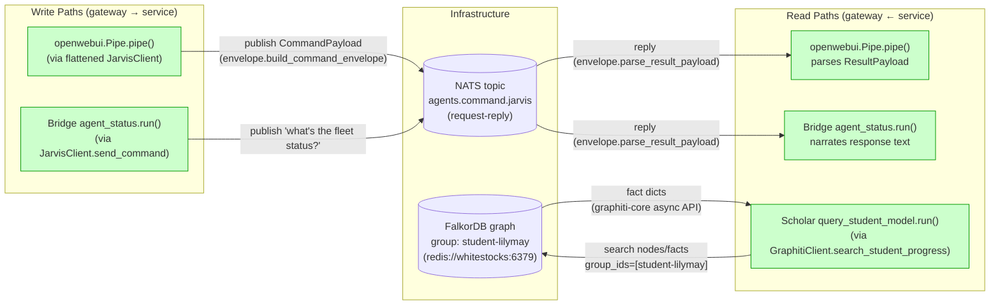
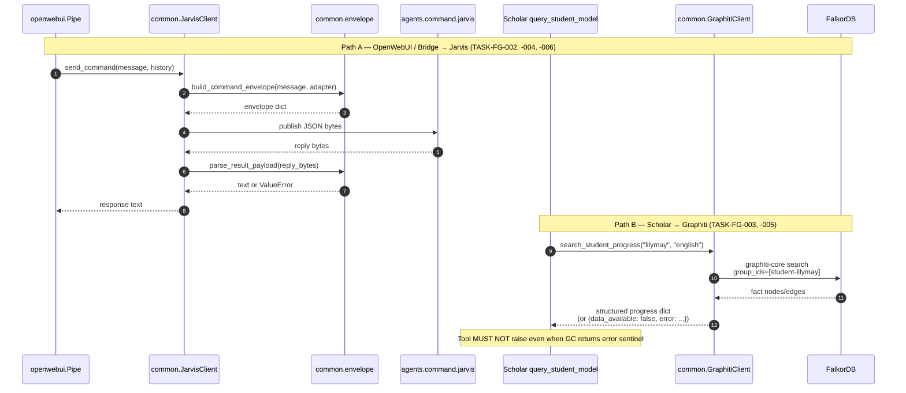
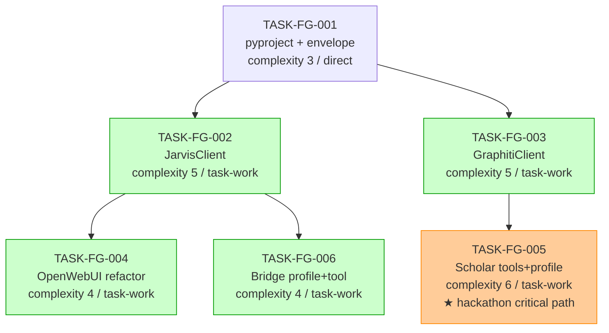

# IMPLEMENTATION-GUIDE: Fleet Gateway Common + Gateway Interfaces (FEAT-FG-001)

**Feature ID:** FEAT-FG-001
**Aggregate complexity:** 6/10 (medium)
**Tasks:** 6 across 3 waves
**Estimated duration:** ~5–7h focused work
**Hackathon target:** 11–13 May (Scholar demo); DDD Southwest 16 May (Bridge demo)

---

## §1: Goal

Build the shared `common/` gateway client library
(`envelope.py`, `jarvis_client.py`, `graphiti_client.py`) and wire it into
the two existing gateways:
- **OpenWebUI Pipe Function** — refactored to consume `common/` at source
  but ship as a self-contained file (Open WebUI cannot pip-install).
- **Reachy Mini external tools** — Scholar (Graphiti reads) and Bridge
  (NATS via Jarvis). Both consume `common/` via editable install in the
  Pollen venv.

The work is **scope-corrected** against scope §7 Q1–Q4 resolutions:
`aiohttp` → `graphiti-core`; REST `/search` → FalkorDB direct; invented
`jarvis.status.query` topic → reuse `agents.command.jarvis`.

---

## §2: Data Flow — Read/Write Paths

This is the most important diagram in this guide. It shows every write
(gateway → service) and every read (service → gateway) for FEAT-FG-001.

_What to look for:_ every write has a corresponding read. No
**in-feature** disconnections.

### Disconnection Alert (informational, not blocking)

Two cross-feature read paths are deliberately **out of scope** for
FEAT-FG-001:

| Disconnection | Why deferred | Tracking |
|---|---|---|
| Jarvis `serve-nats` listener on `agents.command.jarvis` | Jarvis is a separate repo; the receive-side is FEAT-JARVIS-006 | Smoke tests run with NATS mocked; integration runs against the live GB10 Jarvis if available |
| OpenWebUI deploy artifact regeneration | Manual step (or `python openwebui/build_pipe.py`) — not a code dependency | Documented in `openwebui/README.md` per TASK-FG-004 ACs |

These are documented disconnections, not bugs. The implementation-time
risk is "OpenWebUI deploy is stale after `common/` changes" — mitigated
by the build-pipe script and a README runbook entry.

---

## §3: Integration Contract Sequence (complexity ≥ 5 → mandatory)

The two highest-risk paths, sequenced to show where data is handed off
between modules.

_What to look for:_ on Path A, every fetch is passed onward — no
"fetch then discard" anti-pattern. On Path B, the graceful-degradation
sentinel (`data_available=False`) is the ONLY path back to Sch when
FalkorDB is unreachable; the Scholar tool must check that flag rather
than assume the dict is populated.

---

## §4: Integration Contracts

Cross-task data dependencies that must be honoured at the seam.

### Contract: CommandPayload envelope wire format
- **Producer task:** TASK-FG-001 (`build_command_envelope`, `parse_result_payload`)
- **Consumer task(s):** TASK-FG-002 (JarvisClient), TASK-FG-004 (OpenWebUI pipe — via JarvisClient), TASK-FG-006 (Bridge — via JarvisClient)
- **Artifact type:** Python function imports + JSON-encoded bytes published to NATS
- **Format constraint:** dict with keys `version="1.0"`, `event_type="command"`, `source_id="{adapter}-gateway"`, `correlation_id` (UUID v4 string), `payload` (with message text). Round-trip via `json.dumps(envelope).encode()` → publish → `parse_result_payload(reply_bytes)` → text.
- **Validation method:** Coach verifies via the seam test in TASK-FG-002 (`test_command_payload_envelope_format`) which round-trips an envelope through JSON and asserts shape.

### Contract: NATS_URL
- **Producer task:** OPERATOR_CONFIG (Open WebUI Valves; Reachy launch script env var)
- **Consumer task(s):** TASK-FG-002 (JarvisClient), TASK-FG-004 (OpenWebUI Pipe Valves), TASK-FG-006 (Bridge tool — uses default)
- **Artifact type:** environment variable / Valve config
- **Format constraint:** `nats://{host}:{port}` scheme. Phase 1 has no TLS. Default `nats://localhost:4222` (dev), `nats://promaxgb10-41b1:4222` (GB10 deployment).
- **Validation method:** `JarvisClient.__init__` accepts the URL as-is and passes to `nats.connect`; failure raises `ConnectionError` with helpful message (TASK-FG-002 ACs).

### Contract: FALKORDB_URI
- **Producer task:** OPERATOR_CONFIG (Reachy launch script env var or `GraphitiClient` default)
- **Consumer task(s):** TASK-FG-003 (GraphitiClient), TASK-FG-005 (Scholar — via GraphitiClient)
- **Artifact type:** environment variable / constructor default
- **Format constraint:** `redis://{host}:{port}` (e.g. `redis://whitestocks:6379`). graphiti-core connects to FalkorDB; do NOT speak MCP-over-HTTP to `:8004`.
- **Validation method:** Coach verifies via the seam test in TASK-FG-003 (`test_falkordb_uri_format`).

### Contract: Adapter `source_id` naming convention
- **Producer task:** TASK-FG-001 (defines convention via `build_command_envelope`)
- **Consumer task(s):** TASK-FG-004 (`adapter="openwebui"` → `source_id="openwebui-gateway"`), TASK-FG-005 (`adapter="reachy-scholar"` → `"reachy-scholar-gateway"` — n.b. ASSUM-001), TASK-FG-006 (`adapter="reachy-bridge"` → `"reachy-bridge-gateway"`)
- **Artifact type:** string convention embedded in envelope `source_id` field
- **Format constraint:** `{platform}-{role}-gateway` lowercase, no underscores. Per ASSUM-001 (medium confidence): Scholar uses `reachy-scholar-gateway`, Bridge uses `reachy-bridge-gateway`. Re-verify on first end-to-end run.
- **Validation method:** Coach greps consumer task source for the canonical adapter strings; tests in TASK-FG-002 assert envelope `source_id` matches `{adapter}-gateway`.

### Contract: GraphitiClient `search_student_progress` return shape
- **Producer task:** TASK-FG-003 (`GraphitiClient.search_student_progress`)
- **Consumer task(s):** TASK-FG-005 (Scholar `query_student_model`)
- **Artifact type:** Python dict returned from in-process async call
- **Format constraint:** keys `student_name` (str), `streak_days` (int), `level_name` (str), `recent_xp` (int), `near_achievements` (list[str]), `topic_confidence` (dict[str, float]), `data_available` (bool). When unreachable: `{"data_available": False, "error": "<reason>"}` plus optional partial keys.
- **Validation method:** Coach verifies via the seam test in TASK-FG-005 (`test_query_student_model_consumes_progress_dict`).

### Contract: JarvisClient API (no `query_status`)
- **Producer task:** TASK-FG-002 (`JarvisClient.send_command`)
- **Consumer task(s):** TASK-FG-004 (OpenWebUI pipe), TASK-FG-006 (Bridge agent_status)
- **Artifact type:** Python class import; method signature
- **Format constraint:** `async def send_command(self, message: str, conversation_history: list[dict] | None = None) -> str`. **`query_status` is explicitly absent** (per scope §7 Q3 — `jarvis.status.query` topic does not exist). Bridge must call `send_command("what's the fleet status?")`.
- **Validation method:** Coach greps TASK-FG-002 source for `query_status` (must return zero matches); seam tests in TASK-FG-004 and TASK-FG-006 verify they call `send_command` (not `query_status`).

---

## §5: Task Dependency Graph

_Tasks with green background can run in parallel within their wave.
TASK-FG-005 (orange) is the hackathon critical path._

---

## §6: Execution Strategy

### Wave 1 (foundation, sequential)
- **TASK-FG-001** — package setup + envelope module
- Smoke gate: `pytest tests/test_envelope.py -v` and `pip install -e .`

### Wave 2 (parallel, blocked by Wave 1)
- **TASK-FG-002** — JarvisClient
- **TASK-FG-003** — GraphitiClient (graphiti-core, NOT aiohttp)

⚡ **Conductor recommended** — both tasks touch only `common/` and `tests/`,
no overlapping files.

Smoke gate: all client tests pass with mocked dependencies.

### Wave 3 (parallel, blocked by Wave 2)
- **TASK-FG-004** — OpenWebUI pipe refactor (depends on TASK-FG-002)
- **TASK-FG-005** — Scholar tools + profile (depends on TASK-FG-003) ★ critical path
- **TASK-FG-006** — Bridge profile + agent_status (depends on TASK-FG-002)

⚡ **Conductor recommended** — all three touch different directories
(`openwebui/`, `reachy/.../scholar/`, `reachy/.../bridge/`), no overlap.

Smoke gate: 13 BDD smoke scenarios (see `features/.../*.feature`) pass.

---

## §7: Decisions Locked In (from scope §7 reconciliation)

| Decision | Choice | Source |
|---|---|---|
| OpenWebUI shared-code strategy | **Approach A — self-contained file** with source-level reuse | scope §7 Q4 |
| Graphiti client transport | **graphiti-core direct to FalkorDB** (drop aiohttp) | scope §7 Q1 / §6 A1 |
| Reachy `common/` import | **Editable install** (`pip install -e .`) in Pollen venv | ASSUM-010 (Context A concern) |
| Bridge fleet-status path | **`send_command("what's the fleet status?")`** via existing `agents.command.jarvis` | scope §7 Q3 |
| Student model group_id | **`student-lilymay`** (dash form, default in GraphitiClient) | scope §6 A6 corrected |
| Q2 (`get_revision_recommendations`) | **Out of scope** for FEAT-FG-001 | scope §7 Q2 |

---

## §8: Open Risks (from scope assumptions)

| ID | Risk | Mitigation |
|---|---|---|
| ASSUM-001 | Reachy adapter `source_id` naming convention | §4 contract documents the convention; verify on first end-to-end run |
| ASSUM-002 | Bridge phrasing `"what's the fleet status?"` | Verify Jarvis recognises the phrase on first integration run; tweak if needed |
| ASSUM-003 | Pipe log-redaction policy (no user message at INFO) | TASK-FG-004 should add a logging review during refactor |
| ASSUM-004 | Graphiti auth-failure classification distinct from unreachable | TASK-FG-003 AC explicitly requires distinct error messages |
| ASSUM-005 | nats-py loop ownership in Pollen async | Mitigated by connect-per-call pattern in JarvisClient |

---

## §9: References

- Scope: `docs/FEAT-FG-001-scope.md`
- Build plan (pre-reconciliation): `docs/FEAT-FG-001-build-plan.md`
- BDD spec: `features/fleet-gateway-common-and-interfaces/fleet-gateway-common-and-interfaces.feature`
- BDD summary: `features/fleet-gateway-common-and-interfaces/fleet-gateway-common-and-interfaces_summary.md`
- Architecture: `docs/architecture.md`
- Existing implementations: `openwebui/nats_fleet_pipe.py`, `reachy/external_content/external_tools/query_student_model.py`
- Reference pattern (graphiti-core wrapper): `guardkit/guardkit/knowledge/graphiti_client.py`
